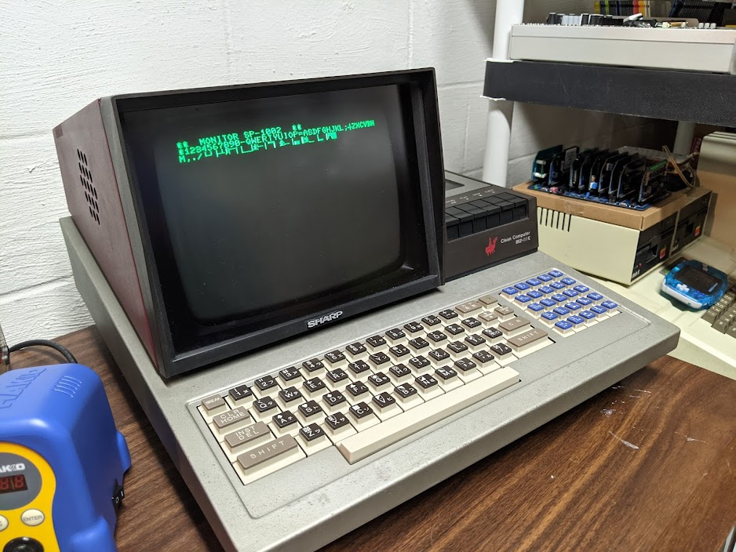

### MZ-80Clone

*A project to create a replica Sharp MZ-80C motherboard.*

---

### Introduction

The [Sharp MZ-80C](https://www.old-computers.com/MUSEUM/computer.asp?c=418&st=1) is a Japanese personal computer from 1979. It sports a 2MHz Z80 processor, 48K of RAM, just enough ROM for a simple monitor, one-bit audio, an integrated cassette recorder, and an integrated green-and-black display. Simply put, it's just a factory-upgraded Sharp MZ-80K with a different case and keyboard.

Pictured above is my personal MZ-80C, purchased in mid-2021 as a junk item to repair via Yahoo Auctions Japan. It wasn't cheap to get to the US, $215 shipping total for a $50 computer, but I have no regrets with what I paid. It's been a staple of my desk since I purchased it, I love the look of the case and it's just a ton of fun to use.

---

### Problem

I've found tons of neat little mods and whatnot but don't really want to modify my original motherboard. Finding a bare board to experiment on is near-impossible, I've yet to see any MZ-80K or MZ-80C boards "just floating around" on sites, and buying another entire machine would be pricey.

---

### Solution

Why not make a replica motherboard similar to what Commodore fans are doing to restore their systems?

---

### Goals

At the moment, being that I don't want to go too over my head, I would like to start by making a 1:1 replica of the MZ-80 motherboard. This would give me what I want, a platform to experiment on.

Eventually, if I can get through that, I'd like to do a few modifications and create an entirely new motherboard. Some simple features which I think I could swing:

* Replace 4116 RAM ICs with something more reliable
* Remove the need for a -12V power supply (probably goes with removing 4116s)
* Replace the cassette mechanism with a modern solution
* Add a video output port for connection to a TV set

I would also like, since finding one seems to be tough, to make plans for a modern I/O box.

---

### Credits

The [Pasocom Mini MZ-80C](https://www.pcmini.jp),

Karl-Heinz's [sharpmz.org](sharpmz.org) and it's continuation by Geir & Jo Even,

ZenMarket for letting me be addicted to retro Japanese computers.
